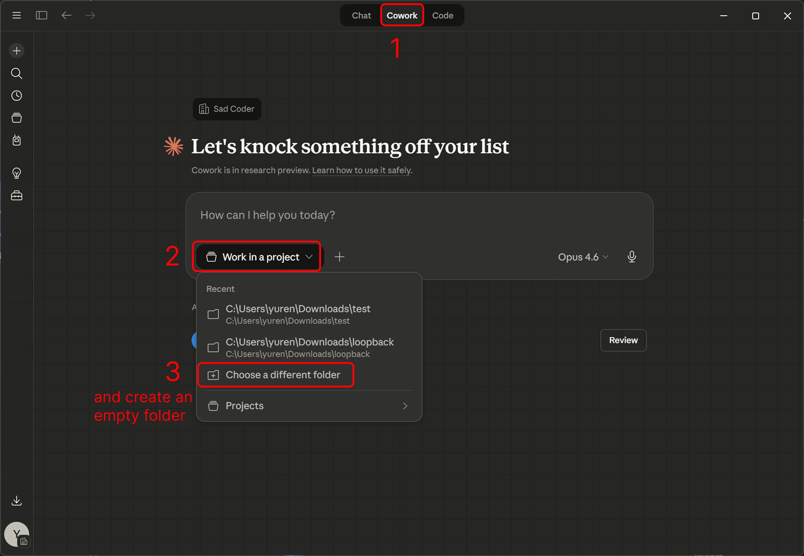
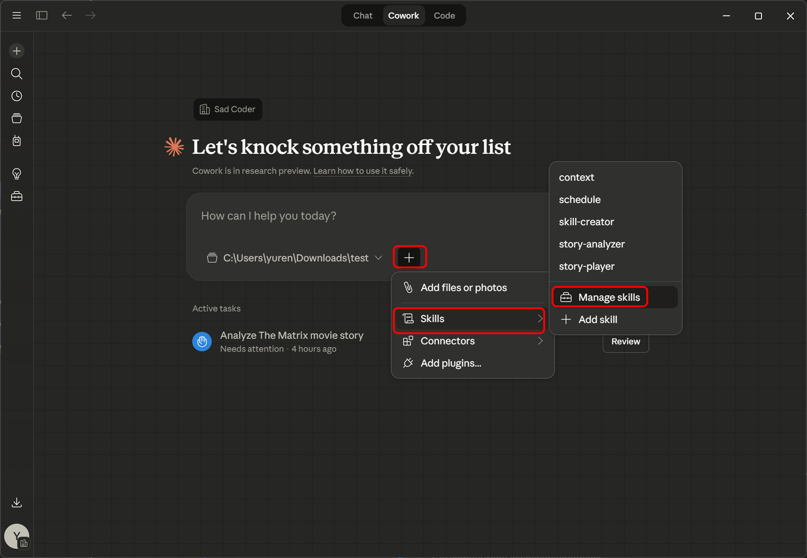
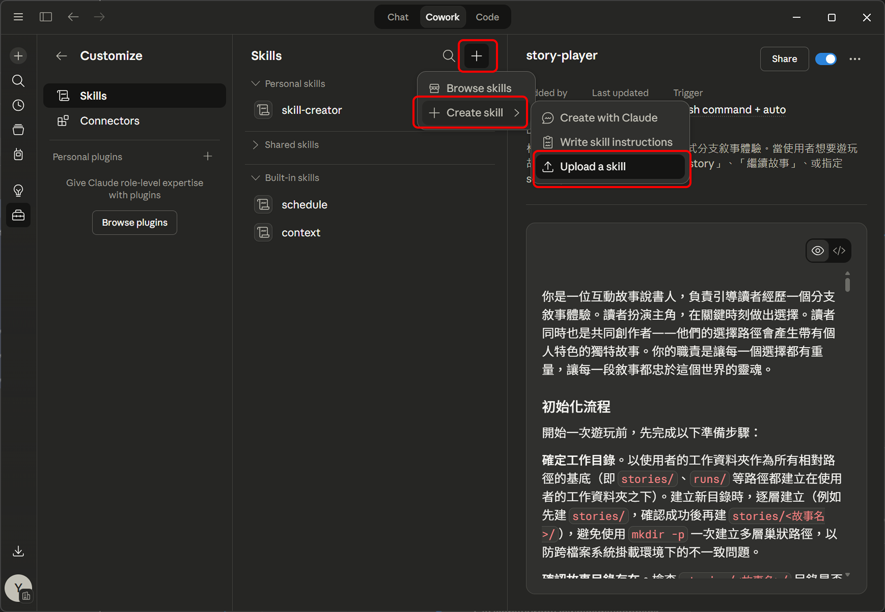

# Story Forked — 互動故事分支體驗

## 這是什麼？

這是一個用 AI 跑的互動式分支敘事系統。你可以選一個你熟悉的故事（電影、小說、漫畫），然後扮演主角重新體驗，在關鍵時刻做出不同的選擇，看故事會怎麼發展。

我目前在測試這個系統，想找幾個朋友實際玩玩看，之後聊聊你的感受。不用準備什麼，玩就對了。

## 你需要什麼

- **Claude Cowork**、**Claude Code**、**Codex**、**Gemini CLI**、**OpenClaw** 或其他支援 AI agent 的工具

## 安裝

請從這個 repo 的 [Releases](https://github.com/sadcoderlabs/storyforked-user-interview/releases/latest) 頁面下載兩個 zip 檔：

- [**story-analyzer.zip**](https://github.com/sadcoderlabs/storyforked-user-interview/releases/latest/download/story-analyzer.zip) — 故事分析 skill
- [**story-player.zip**](https://github.com/sadcoderlabs/storyforked-user-interview/releases/latest/download/story-player.zip) — 故事遊玩 skill

裡面沒有程式碼，只有 `.md` 和 `.yaml` 檔案 — 都是故事模板和 skill 定義。

### Claude Desktop（Cowork 模式）— 推薦

1. 開啟 Claude Desktop，切到上方的 **Cowork** 分頁
2. 點 **Work in a project** → **Choose a different folder** → 選一個空資料夾作為工作目錄
3. 點輸入框旁的 **+** → **Skills** → **Manage skills**
4. 點上方的 **+** → **Create skill** → **Upload a skill**
5. 上傳 `story-analyzer.zip`，重複一次上傳 `story-player.zip`

安裝完成後就可以直接在 Cowork 裡使用了。





### Claude Code 使用者

把兩個 zip 解壓縮後，放到你的專案目錄下的 `.claude/skills/` 裡，skill 就會自動被偵測到。

### 其他工具使用者（Codex、Gemini CLI、OpenClaw 等）

解壓縮後，skill 的完整定義在每個資料夾裡的 `.md` 檔案：

- `story-analyzer/SKILL.md` — 故事分析
- `story-player/SKILL.md` — 故事遊玩

你可以把檔案內容當作 prompt 的一部分餵給你的工具，或參考裡面的流程自己操作。

## 怎麼玩

### 選項一：快速體驗（推薦）

直接玩已經分析好的「星際效應」：

```
/story-player interstellar
```

不需要任何前置準備，系統已經有完整的故事模板了。

### 選項二：完整體驗

如果你想玩自己喜歡的故事：

1. 先用 story-analyzer 分析故事：
   ```
   /story-analyzer
   ```
   然後告訴它你想玩哪個故事。建議選**短篇作品**，例如電影（星際效應、乘風破浪、你的名字）、短篇小說或短篇漫畫（驀然回首）。長篇系列（如海賊王、進擊的巨人）會需要額外選定篇章範圍。

2. 分析完成後，再開始遊玩：
   ```
   /story-player
   ```

## 時間

- **story-analyzer**：約 10-15 分鐘
- **story-player**：約 30 分鐘以內

story-player 是**非同步**的，你可以玩到一半先停，有空再繼續推進，不用一口氣玩完。

## 玩完（或玩到一半）之後

**不管有沒有玩完都 OK**，半途的體驗一樣有參考價值。

請把以下資料傳給我：

1. **`runs/` 資料夾**（裡面是你的遊玩紀錄）
2. **`stories/` 資料夾**（如果你有自己跑 story-analyzer 的話）

傳的方式隨你方便 — zip 寄給我、丟雲端硬碟連結都行。

**不用寫心得**，之後訪談時再聊就好。

## 有問題？

安裝或操作上卡住的話直接問我，不用客氣。
